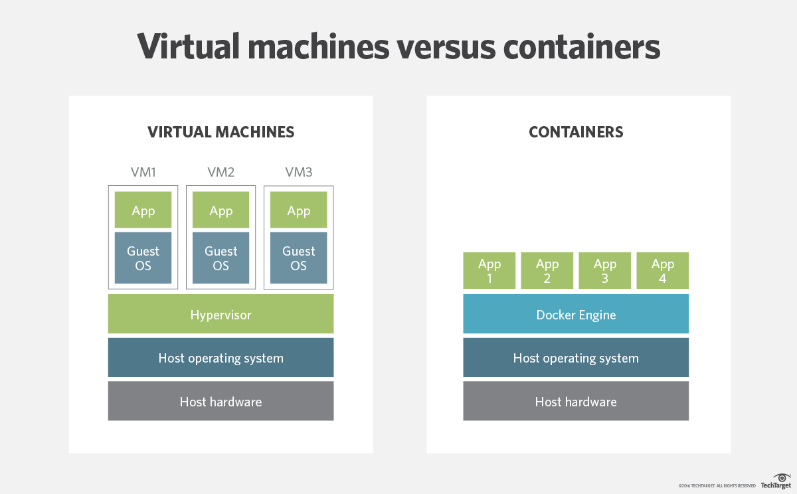
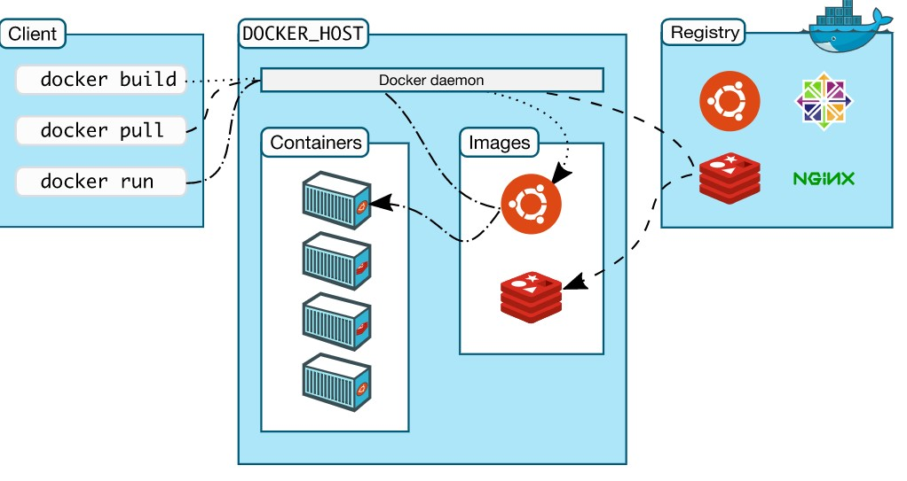

# Docker

### What is Docker?
- It's an open source platform for containerization
- Docker enables you to separate your applications from your infrastructure so you can deliver software quickly
- You run applications in loosely isolated environments called `containers`

<br>

### Why docker?
- Multi-billion dollar companies are using Docker every day
- Docker adoption is predicted to have been 50% at the end of 2020 

<br>

### What's the difference between a VM and a container?



- Docker is more light weight and only shares the resources of an OS rather than using the OS completely

- As they are isolated, one can run many containers simultaneously on a given host. Containers are lightweight as they don't require the extra load of a hypervisor but also runs directly in the kernel.
    - You can run more containers in a given machine than you can VMs

- What is a hypervisor?
    - A hypervisor, also known as a virtual machine monitor or VMM, is software that creates and runs virtual machines (VMs). A hypervisor allows one host computer to support multiple guest VMs by virtually sharing its resources, such as memory and processing. 

<br>

### Main commands
- Refer to the documentation [here](https://docs.docker.com/engine/reference/commandline/docker/)

- Mostly, `<name>` and `<id>` are interchangeable

- `docker images` - lists all images
- `docker ps <name>` - lists containers (add `-a` to list all available containers)

<br>

- `docker run <name>` - run an image, either from registry or local files
- `docker build <name>` - builds an image from a Dockerfile
- `docker start <name>` - start one or more containers
- `docker stop <name>` - stop one or more containers
- `docker exec <name>` - runs a command in a running container

<br>

- `docker rmi` - removes images
- `docker rm` - removes containers
- `docker logs <name>` - fetches logs of the container

<br>

- `docker commit <name>` - creates a new image from a container
- `docker push <name>` - pushes an image onto Docker Hub
- `docker pull <name>` - will pull an image or repo from the registry

<br>

### How does it work?



- Running commands in CLI passes them into the Docker daemon (the background process) 
    - If you need to `pull` images it will take it from the registry and download it into your docker desktop
    - If you have the image avalable already, it will not need to download it from the registry

<br>

### Starting and stopping containers
- When we `pull` any images from dockerhub, we can run them within containers

- To check the images you currently have, you can `docker images`

- To start a container with an image, you can `docker run -d -p <port>:<docker port> <image-name>`
    - If you run `docker ps` you can see any running containers
    - To stop a container you can `docker stop <id>`
    - You can check available containers with `docker ps -a`
    - To start a container again you can `docker start <id>`
    - TO remove a container from the list of available containers you can `docker rm <id>`

<br>

### Making docker docs available on our localhost
- We can pull an image from the docs called `docs/docker.github.io`

- We can put this in a container all in one command using `docker run -d -p 4000:4000 docs/docker.github.io`

<br>

### Mapping container ports 

- We can map docker ports to different localhost ports through specifying the `-p` option when using `docker run`
    - For instance, if we wanted to run the `nginx` image on port 4000 (i.e. `localhost:4000`), we would run the command `docker run -d -p 4000:80 nginx`
    - This would map the port 80 from the container (where nginx runs by default) to port 4000 on localhost
- Documentation for `docker run -p` is [here](https://docs.docker.com/engine/reference/commandline/run#publish-or-expose-port--p---expose)

<br>

### Entering a container
- We can enter a container through `docker exec` and run commands in the container using this

- If we wanted to run commands inside the actual container (similar to SSH) we can specify the `-i` option (`i` for "interactive", which keeps STDIN open even if not attached)
    - Further, we can allocate a pseudo-TTY with the `-t` option
    - So finally, `docker exec -it <container_id> bash` will allow us to enter the container and run commands there

- Documentation for `docker exec` is [here](https://docs.docker.com/engine/reference/commandline/exec/)

<br>

### Copying files from local machine into a container
- Make use of `docker cp <path-to-file-on-local-machine> <container-id-or-name>:<path-on-container>`

- So if we wanted to copy a file named `index.html` in the current directory to the nginx default directory, one would use `docker cp index.html <container_id>:/usr/share/nginx/html/`

<br>

### Putting images onto DockerHub
- When we have a container up and running, we can configure it to whatever we like
    - We used the base `nginx` image from DockerHub and input our own `index.html` file on the default page
    - This container can now be made into a new image and pushed onto DockerHub

- We first have to create a new image of the container:
    - Use `docker commit <container_id_or_name> <username_on_dockerhub>/<repo_name>:<tag>`
    - In my case: `docker commit <container_name> jaredsparta/image-1:latest`

- If one runs `docker images`, the image of the container will now be in the list. All we now need to do is push it to DockerHub:
    - Use `docker push <repo_name>`
    - In my case, `docker push jaredsparta/image-1`
    
<br>

### Getting logs from a docker container
- We can retrieve logs from a container using `docker logs <name>`

- We can pipe the logs into a `.txt` file using `docker logs <name> >> logs.txt`
    - This places the logs in a file called `logs.txt`

<br>

### Building docker images
- To create a docker image we need to create a `Dockerfile`
    - It is case-sensitive and has no extension

- Creating images in this way is more helpful than running containers and executing commands inside them
    - This is an automated way to do so

- What gets put in the `Dockerfile` depends wholly on what the image is going to be doing in a container 

- Best practices for building Dockerfiles found [here](https://docs.docker.com/develop/develop-images/dockerfile_best-practices/)

<br>

### Writing the `Dockerfile`
- `FROM` is used to tell docker which base image to use to build the image
- `LABEL MAINTAINER=jsolano@spartaglobal.com` tell others who maintains the image
- `COPY <path-on-localhost> <path-on-image>`
- `EXPOSE` for the default port
- `CMD` 

<br>

### Dockerising the node.js app
- As always, we return to our node js app. We eventually want to move to a microservices architecture so it is important we know how to containerise apps

- How did we write it's `Dockerfile`?
    - Node documentation [here](https://nodejs.org/en/docs/guides/nodejs-docker-webapp/)
    - Bare in mind that the Dockerfile for the app is found in the `app` directory
    ```docker
    FROM node
    WORKDIR /usr/src/app
    COPY . .
    RUN npm install
    EXPOSE 3000
    CMD ["node","app.js"]
    ```
    - We want to use the `node` base image: `FROM node`
    - We want to switch directories to where we will place our app files: `WORKDIR /usr/src/app`
    - We copy over the app files into this directory: `COPY . .`
    - We must install the app dependencies: `RUN npm install`
    - We run the app on port 3000 in containers: `EXPOSE 3000`
    - We specify that the app runs in the container: `CMD ["node", "app.js"]`

<br>

### Microservices vs. Monolith


<br>

- Monolithic architecture:
    - Why:
        - Easier debugging and testing
        - Very simply to deploy as it is just a single service
        - Simple to develop
        
    - Why not:
        - Whenever changes need to be pushed, one would need to restart the entire structure. This results in potential downtime whenever new versions are made.
        - Hard to scale up as one would need to scale the entire structure
        - Hard to apply new technologies within this setup

<br>

- A microservce architecture:
    - Why:
        - Ideal for large-scale projects
        - Loosely coupled so there are less breaking points
        - Independently deployable
        - The services are organised around business capabilities which gives way to easier to applications that are easy to understand
        - Highly maintainable and testable
        - Easy to implement new technologies

    - Why not:
        - Added complexity which may confuse smaller, less experienced teams
        - Testing is harder than for monolithic
        - A carefully crafted distribution system is required as there would be many moving parts

<br>

### Multi-stage builds

- The following `Dockerfile` creates an image that is around `976 mb`

```docker
FROM node
WORKDIR /usr/src/app
COPY . .
RUN npm install
EXPOSE 3000
CMD ["node","app.js"]
```

- The following `Dockerfile` will significantly reduce the image size. Adding the second stage as shown will reduce the size to only `136 mb`
- Why would we do it this way and not just use `node:alpine` immediately?
    - Different base images have different functionalities, the original `node` image has all the necessary functionalities for most apps, and when we add the extra layer we take those necessary dependencies and put them into the `node:alpine` image. This will reduce the entire size of the image.
    - Of course if the app could run immediately with `node:alpine`, then you could just use alpine initially 

```docker
FROM node as APP
WORKDIR /usr/src/app
COPY . .
RUN npm install


# Building a multi-stage layer
# This second FROM block represents a new stage of the build
# This is the reason why there is an extra WORKDIR -- we are in another env and need to change directory there too
FROM node:alpine
COPY --from=app /usr/src/app /usr/src/app
WORKDIR /usr/src/app
EXPOSE 3000
CMD ["node", "app.js"]
```

<br>

### S3 Bucket and CloudWatch
- It stands for "simple storage service" -- a data storage service on AWS
    - Think of it simply as a hard-drive on AWS

- S3 buckets are available globally

- There are a couple of services within S3:
    - Example: 
        - Netflix has a new movie out and everyone will want to view it, so we put it in S3
        - After a few months, you can place it into `S3 Glacier`

- S3 is used with CloudWatch to ensure there is a disaster recovery plan